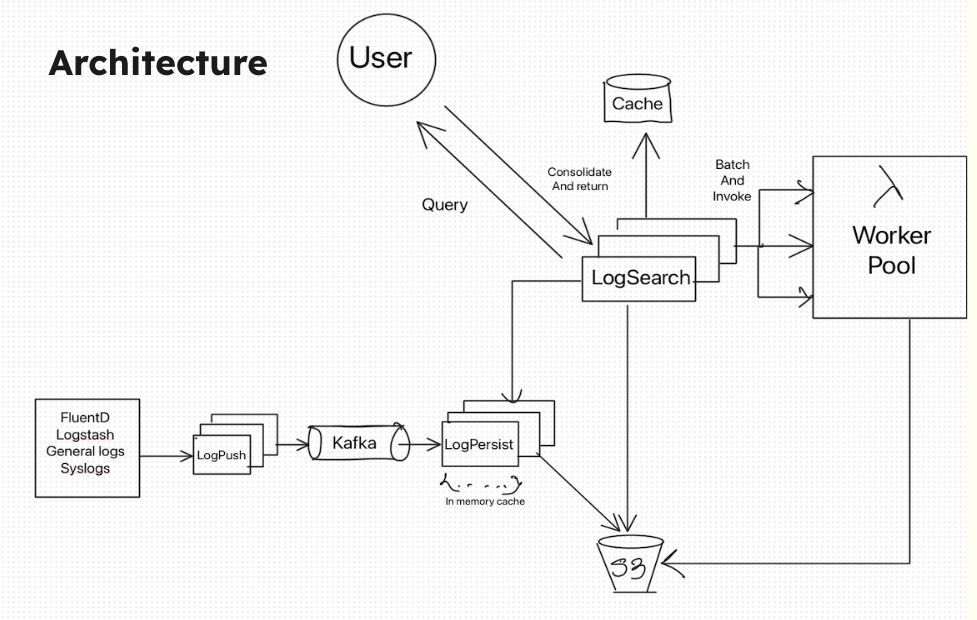
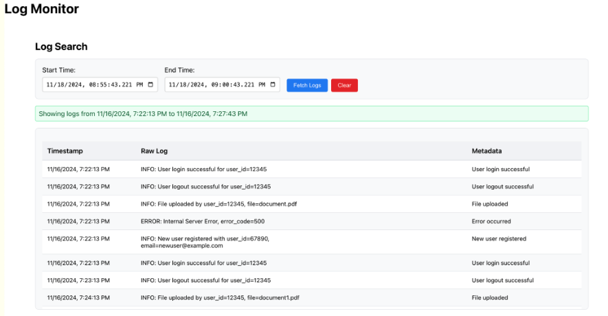

# Event Storage System
A micro-service based project which uses serverless compute to retrieve and search data from object storage like S3.

[Project Report](https://drive.google.com/file/d/1XUzXbl59cbNiDq2CCOysHPKWMzEyuUAa/view?usp=sharing)

## What problem this project is solving ?
Event logging and storage are among the key features in modern distributed systems, enabling organizations to track system behaviors, diagnose issues, and perform analytics on system performance. With ever-increasing application size and complexity, the volume of log data has grown exponentially, creating challenges in ingestion, storage, processing, and retrieval. Traditional log management systems scale inefficiently, with many failing to handle real-time data and provide fast search capabilities over large datasets.

## System Architecture


## Potential UI 


## Why Golang
well its very easy to manage concurrency with go. (channels and waitgroups are just too powerful)
## Build Steps

I have containerized every micorservice. Based on the the machine architecture(ARM/ AMD), you will need to buid docker images of each microservice.

### Microservices

#### log-push
This service is where customer push all the logs. (via POST requests). 
- multiple events in one request
- validation of the data
- timestamp checks
- push to kafka topic for further processing

Build image 
```bash
cd logPush
#ess stands for event-storage-system
docker build -t ess/log-push .
```

#### log-persist
log-persist persists the events on the object storage (S3). Object keys are made using timestamp so that its easy for retrieval later.
- store in flight logs using in memory cache for making it retriavble ASAP to log-serach
- capable of performing full event filtering on the in-memory data
- smart creation and timestamp key assignment to the final object-storage files
- hashing the objects for further deduplicaition of the events further from log-search

Build image 
```bash
cd log-persist-v2
#ess stands for event-storage-system
docker build -t ess/log-persist .
```

#### log-search

log-search is the service with which user interacts with the events by providing a search functionality with regex and string matching.
- making subtasks for a query based on number of s3 objects to scan for events
- invoking lambda function (severless) based on number of tasks and distribution of s3 objects to perform filtering
- consolidating filtered data from lambda functions and log-write(in-flight data) and dupping data gradually to the Redis cache with unique query ID
- deduplication of the data based on hashes of the objects processed
Build image 
```bash
cd logSearch
#ess stands for event-storage-system
docker build -t ess/log-serach .
```

#### UI
well its not technically a microsrvice but it has its own features.(simple ui built with react)
- continuosly polling the log-serach api to get the search results gradually. 
- dynamic scrolling (gradulally retrieval of results) 

Run UI
```bash
cd log-serach-ui
#ess stands for event-storage-system
npm start
```

### Infrastructure needed to start the runnig the project
After building all the images from microservices, you can bring all services up with docker compose.

```bash
cd infra
docker-compose up -d
```

#### Kafka cluster
This is probably backbone of decoupling the incoming traffic and event processing/writing steps

#### Object storage
You can either deploy using S3 AWS service or deploy a stand-alone serve (using Minio - the docker-compose in infra using a minio image to store objects locally)

#### Lambda function (Serverless)

If you have AWS credits you can probably deploy the code in directory "lambda" as a function which has to have access to the events objects in object storage.
But, for playing around to know how system works, you can probably use lambda-runtime-environment (LRE). 
few ponints to note about the LRE
- only one invocation at a time
- bit slower because its basically simulating the lambda runtime


## Identified limitations
- there is always a cap to the parallel lambda invocations : (around 1000 lmabdas/region)
- most of the time in lambdas are spent over makeing GET calls to S3 objects
- improve storage methods : switch to Coulumnar based storage solutions for faster processing


# Improvements 
## log-persist inconsistent distribution across replicas due to kafka partition (hash)

same type of logs will lead to put stress on just one replica. 

### solution 
Add virtual nodes.


